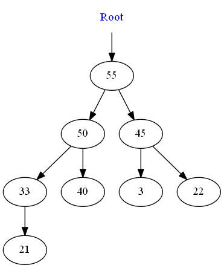
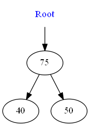
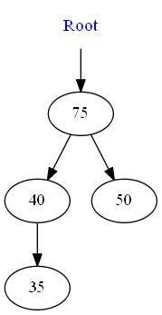
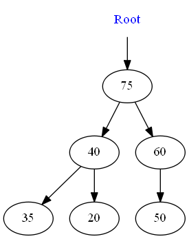
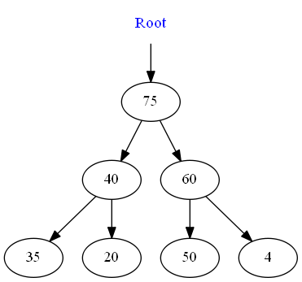
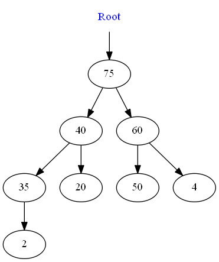
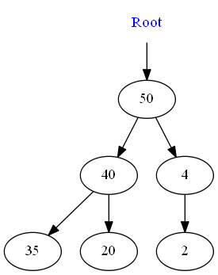
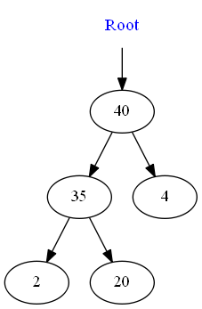
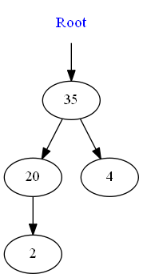
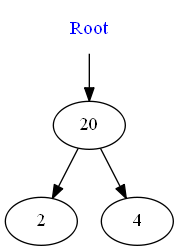

MAX HEAP
====================
Building with AppVeyor: 

Building with Travis: 

This repository has a project with the implementation of a MAX HEAP.

It is written in C++.

The code of the MAX HEAP is independent of platform.

Is has two possible main files:

* [Codes](#markdown-header)
	* [A main that triggers unit test;](#markdown-header-emphasis)

	* [A Qt project to manage the MAX HEAP (With Gui).](#markdown-header-strikethrough)
	
The library used to make the Unit Test is the Catch v2.12.3. The code is already in this repository.

The Qt project generates images of the MAX HEAP, using the lib Graphviz.
Install this lib in your computer for you to be able to create such images.

The code was written containing the Doxygen documentation.

- - -

You have several options to build the project: 
====================

* [Build tools](#markdown-header)
	* [Makefile (using the file named MakefileGeneral);](#markdown-header-emphasis)
	* [CMake.](#markdown-header-emphasis)
	* [Qt Project (With QMake).](#markdown-header-emphasis)

The project has no leaks (Fully tested with Valgrind).

All the unit tests are ok.

- - -

The functionalities available are: 
====================

* [Functionalities](#markdown-header)
	* [Insert;](#markdown-header-emphasis)
	* [Remove maximum number;](#markdown-header-emphasis)
	
- - -

Sample images: 
====================

Insertion steps: 
====================

## Initial

## Inserting 40

## Inserting 50

## Inserting 75

## Inserting 35

## Inserting 20

## Inserting 60

## Inserting 4

## Inserting 2

Remove min steps: 
====================

## Initial

## Removing max

## Removing max

## Removing max

## Removing max

## Removing max

## Removing max

## Removing max

## Removing max

Qt gui project: 
====================
The qt gui application gui is shown below:

